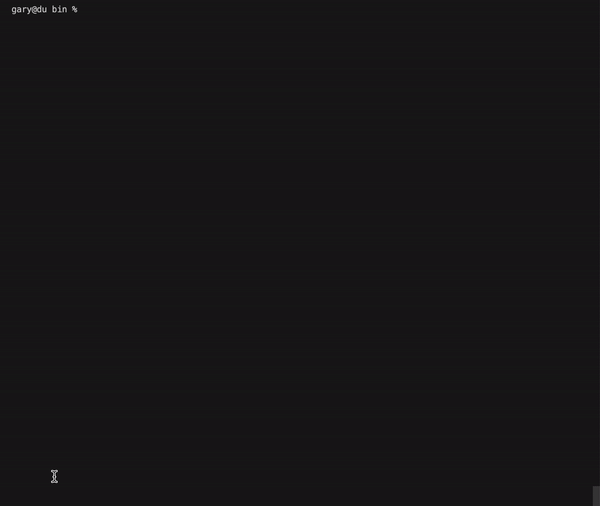

# Blade-cpp SDK demo app


[](https://www.youtube.com/watch?v=RIiEelrwWCA "Demo video")

[Demo video](https://www.youtube.com/watch?v=RIiEelrwWCA "Demo video")

## Disclaimer

As Blade-cpp SDK using https://github.com/hashgraph/hedera-sdk-cpp, which still in development there are limited functionality now. 

Cureently, please use ECDSA keys only

## Commands to build locally (macos example)

```
git clone git@github.com:Blade-Labs/cpp-blade-demoapp.git
cd cpp-blade-demoapp
git submodule update --init
cmake --preset macos-arm64-release
cmake --build --preset macos-arm64-release
cd package/bin && ./demo-application
```

## Build and run in docker container (WIP)

`docker build --build-arg SSH_PRIVATE_KEY="$(cat ~/.ssh/id_ecdsa)" -t blade-demo-image .`

## main.cpp

In demo app used TerminalUI lib: https://github.com/ArthurSonzogni/FTXUI

In this app used basic components from FTXUI. 
App contains three tabs, menu, buttons and inputs.
Some demodata present to demonstrate some functions quickly. 
At the bottom of UI there is Output section, with execution time in ms an serialized output.
Also at the end of main() there are some more examples commented out, please check 

## CMakeLists.txt

Please check how to add cpp-blade sdk

```
# BLADE-CPP SDK
add_subdirectory(libraries/blade-cpp)
target_link_libraries(${PROJECT_NAME} PRIVATE blade-cpp)

find_package(gRPC CONFIG REQUIRED)
target_link_libraries(${PROJECT_NAME} PRIVATE c-ares::cares)
include_directories(${CMAKE_BINARY_DIR}/_deps/hedera-sdk-cpp-src/${CMAKE_BUILD_TYPE}/${CMAKE_HOST_SYSTEM_NAME}/${CMAKE_HOST_SYSTEM_PROCESSOR}/include)

install(FILES
        ${CMAKE_SOURCE_DIR}/libraries/blade-cpp/assets/mainnet.pb
        ${CMAKE_SOURCE_DIR}/libraries/blade-cpp/assets/previewnet.pb
        ${CMAKE_SOURCE_DIR}/libraries/blade-cpp/assets/testnet.pb
        DESTINATION bin/addressbook)

# /BLADE-CPP SDK
```

Also please check `CMakePresets.json` file.